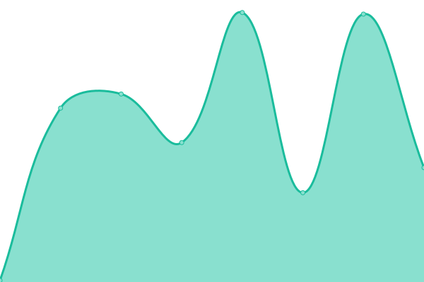

# [📈 Live Status](https://status.scidroid.me): <!--live status--> **🟩 All systems operational**

This repository contains the open-source uptime monitor and status page for [SciDroid](scidroid.me), powered by [Upptime](https://github.com/upptime/upptime).

With [Upptime](https://upptime.js.org), you can get your own unlimited and free uptime monitor and status page, powered entirely by a GitHub repository. We use [Issues](https://github.com/scidroid/status/issues) as incident reports, [Actions](https://github.com/scidroid/status/actions) as uptime monitors, and [Pages](https://status.scidroid.me) for the status page.

<!--start: status pages-->
<!-- This summary is generated by Upptime (https://github.com/upptime/upptime) -->
<!-- Do not edit this manually, your changes will be overwritten -->
<!-- prettier-ignore -->
| URL | Status | History | Response Time | Uptime |
| --- | ------ | ------- | ------------- | ------ |
|  [Website / Blog / Portfolio](https://scidroid.me) | 🟩 Up | [website-blog-portfolio.yml](https://github.com/scidroid/status/commits/HEAD/history/website-blog-portfolio.yml) | 

 135ms
     
 | 

<a href="https://status.scidroid.me/history/website-blog-portfolio">100.00%</a>
    

|  [Extravaganzza blog](https://blog.scidroid.me) | 🟩 Up | [extravaganzza-blog.yml](https://github.com/scidroid/status/commits/HEAD/history/extravaganzza-blog.yml) | 

 36ms
     
 | 

<a href="https://status.scidroid.me/history/extravaganzza-blog">100.00%</a>
    

|  [API endpoint](https://scidroid.me/api/view/test) | 🟩 Up | [api-endpoint.yml](https://github.com/scidroid/status/commits/HEAD/history/api-endpoint.yml) | 

 3269ms
     
 | 

<a href="https://status.scidroid.me/history/api-endpoint">100.00%</a>
    

|  [Links / CDN page](https://link.scidroid.me) | 🟩 Up | [links-cdn-page.yml](https://github.com/scidroid/status/commits/HEAD/history/links-cdn-page.yml) | 

 115ms
     
 | 

<a href="https://status.scidroid.me/history/links-cdn-page">100.00%</a>
    

|  [Image hosting](https://s2.loli.net) | 🟩 Up | [image-hosting.yml](https://github.com/scidroid/status/commits/HEAD/history/image-hosting.yml) | 

 581ms
     
 | 

<a href="https://status.scidroid.me/history/image-hosting">100.00%</a>
    

|  Email sender API | 🟩 Up | [email-sender-api.yml](https://github.com/scidroid/status/commits/HEAD/history/email-sender-api.yml) | 

 406ms
     
 | 

<a href="https://status.scidroid.me/history/email-sender-api">100.00%</a>
    

|  Automations API | 🟩 Up | [automations-api.yml](https://github.com/scidroid/status/commits/HEAD/history/automations-api.yml) | 

 95ms
     
 | 

<a href="https://status.scidroid.me/history/automations-api">100.00%</a>
    

<!--end: status pages-->

[**Visit our status website →**](https://status.scidroid.me)

## 📄 License

- Powered by: [Upptime](https://github.com/upptime/upptime)
- Code: [MIT](./LICENSE) © [SciDroid](scidroid.me)
- Data in the `./history` directory: [Open Database License](https://opendatacommons.org/licenses/odbl/1-0/)
